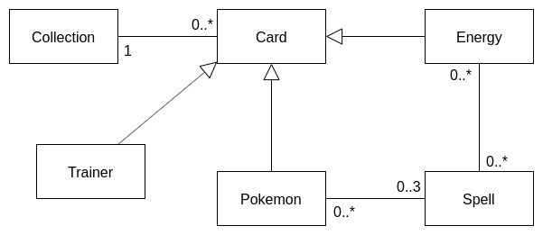
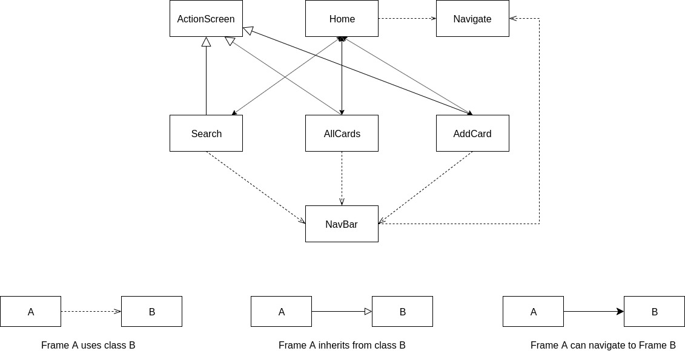

# Report - pokédeck project

## Introduction
### Scope
As part of the java course, we had to develop a java swing application, that classify cards from the Pokémon Trading Card game.

We had several documents to help use along the way :
- [Project topic](https://esling.github.io/documents/Java_Pokedeck.pdf)
- [Pokémon TCG rules](https://assets.pokemon.com/assets/cms2-fr-fr/pdf/trading-card-game/rulebook/xy01_rulebook_fr.pdf)

### Objectives

Create an application to classify cards from the Pokémon Trading Card Game in Java. Implement a swing user interface. Being able to add and delete cards, being able to consult the collection, and search for a specific card.

## Specification

### Back
- CRUD card (Create, Read, Update, Delete)
- Get the collection : array of cards
- Search method
- Save everything inside a Json file

### Front
- Navbar with several views

#### Search & results
- Text field: to search a card based on its name and its number
- Button to submit
- Display a list of results matching the query

*Evol: add filters by pokemon type, characteristic, ...*

#### Card details
- Display the details of a card (all attributs)
- List of the evolutions (with link)
- Button to modify/delete the card

*Evol: graphical representation of attributs.*

#### New/modify card form
- Basically display a form to create or update a card

***Idea: use pokemonTCG Api to add card***

### Note
In this application we are going to consider all the different verion of each card, in every expansion.

## Application design

### Back

#### Card 
Abstract class, basic card with following attributes : type, number and specific type.

#### Trainer, Pokémin, Energy
These classes inherit from Card, and represent the three main types of cards in the game.

#### Spell
Each pokémon card has one or more attacks or spells, as we call it here. Each spell requires a certain amount of energy to be used.
The pokémon class will therefore have an attribute: "spell" array. And this class will have an array of "energy" needed to use the spell.

#### Collection
Only one attribute, which is an array of card, represent all the added card.
This class will contain the method to add/delete cards from the collection and handle the modification of the Json file.

### Front - Swing interface

#### Global explanation
Our user interface will be compose of four main screens. Home, Search, AllCards and AddCard. We'll have an other screen for card details. 
As shown in the diagram, classes can interact with each other in three differents ways.
- Class A uses class B 
The four main frames are going to use the components NavBar, and Navigate. The NavBar will be placed at the top of each frame to navigate between each views. And the class Navigate will handle the navigation itself.

- Class A inherits from class B 
The frames Search, AllCards and AddCard inherit from the class ActionScreen. This class will setup the frame, the layout and the NavBar.

- Class A can navigate to class B 
Here we can see that navigation only concern classes that are actually frames. So the four frames can navigate to each other.

#### Home
Frame that will display the title of the app and a navigation tools to go to the other views.

#### ActionScreen
Abstract class that will setup the following frames with the NavBar and the layout. 

#### Search
Frame that will contain a text field to search for a card by keyword.

#### AddCard
Frame that will contain a form to add a new card to the collection.

#### AllCards
Frame that will contain a list of all the cards in the collection.

#### NavBar
Component that is going to be used to navigate between the frames. This component will appear on every frame except the "home" one.

#### Navigate
Class that will handle navigation between the frames. This class is used inside the NavBar component and the Home frame.

## Implemented features

### Back
- Card: Create / Read
- Collection:
    - Get data from the Json file and create objects from it
    - Add card to collection and update Json file
    - Remove card from collection and update Json file
- Save everything inside a Json file

### Front
- Home
    - Display title
    - Navigation button
- NavBar
    - Title of current frame
    - Navigation buttons
    - Implemented in the following frame
- Search
    - Text field and button that trigger a research in the collection based on the keywords. Attributes concerned by research are name, type, specific type and expansion name.
    - Display the results in list format. Each result is a button to navigate to the card details (not implemented yet).
    - Scroll Panel
- AddCard (*Development stage*)
    - Button to add a new blank card.
    - Button to delete the last card of the collection.
- AllCards (*Development stage*)
    - Display all cards from the collection in list format. Each result is a button to navigate to the card details (not implemented yet).
    - Scroll Panel
